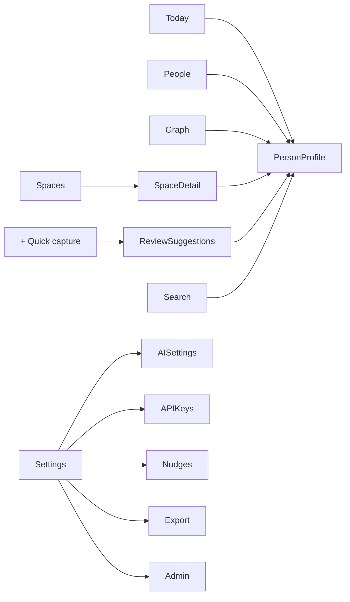

# FolkBook — UI Flows

Screens, flows and interaction ideas to design in Claude Design and then implement.
Status: draft. Update it as decisions change.

---

## 1. Design direction: warm notebook

FolkBook should feel like a **personal address book**, not a corporate CRM.

- **Palette:** warm paper background (cream / off-white), ink-dark text, one accent ink color (e.g. deep blue or burgundy), muted tab colors for spaces
- **Type:** a serif for names and headings (the "handwritten address book" feel), a clean sans for UI and body text
- **Materials:** subtle paper texture, index-card and sticky-note shapes, tabbed dividers, polaroid-style photos
- **Dark mode:** "notebook at night": warm charcoal paper, cream ink. Not pure black
- **Motion:** short, purposeful, physical (paper, ink, tabs). Always respect "reduce motion"
- **Restraint:** the notebook metaphor lives in details, not everywhere. Forms and lists stay fast and plain

---

## 2. Navigation

| | Mobile (bottom tab bar) | Desktop (left sidebar) |
|---|---|---|
| **Today** | ✓ | ✓ |
| **People** | ✓ | ✓ |
| **Graph** | ✓ | ✓ |
| **Spaces** | inside People (filter chips) | ✓ own section |
| **Quick capture** | center "+" button | "Quick capture" button + `Shift+N` |
| **Add person** | from People | `N` shortcut, command palette |
| **Search** | top of People | `Ctrl/Cmd + K` command palette |
| **Settings** | avatar menu | avatar menu |

---

## 3. Flows

### 3.1 First run (server admin)
1. Open the fresh instance → "Welcome to your FolkBook" setup page
2. Create the admin account
3. Create your **Me** profile (name, photo, birthday), shown as the first card in your notebook
4. Optional steps (skippable): import contacts (.vcf) · add an AI key · invite others
5. Land on **Today** with a friendly empty state ("Your notebook is empty, add your first person")

### 3.2 Invite & join
1. Admin → Settings → Users → **Create invite link** (optional expiry, optional email note)
2. Invitee opens link → creates account → creates **Me** profile
3. Same optional steps as first run
4. If the invite came with a shared space, show "Defne shared *Hackathon 2026* with you" on Today

### 3.3 Add a person (manual)
1. "+" → **Add person**
2. Minimal form: name (required), photo, "how we met", spaces (multi-select chips)
3. "More details" expands: birthday, contact info, tags
4. Save → lands on the new profile with a hint: "Add something to remember about them"

### 3.4 Person profile (the most important screen)
Top to bottom:
1. **Header:** polaroid photo, name (serif), "how we met" line, space tabs (shared ones marked with a people icon)
2. **Remember:** memory aids as sticky notes (kids' names, allergies, favorite team…). Add, edit or pin quickly. Always private
3. **Notes:** free-form, private
4. **Connections:** relationships list + mini graph; family relations grouped (parents, partner, siblings, derived: cousins, in-laws)
5. **Timeline:** interactions (met, called, coffee…), newest first
6. **Keep in touch:** off / every N weeks / custom (only when nudges are enabled)

Actions: edit · add relationship · log interaction · add to space · open in graph · delete.

For a **shared person you don't own**: basic profile is read-only (or editable with editor role); your notes and memory aids are still yours and private. A small "Shared by Defne · Hackathon 2026" label.

### 3.5 Quick capture with AI
1. "+" → **Quick capture** → a notebook-page textarea
   *"Met Tom at the hackathon, designer at Spotify, he's Emma's cousin, likes climbing"*
2. Optional: pick a default space for everything captured (e.g. "Hackathon 2026")
3. **Suggest**: AI returns a draft:
   - New people (with fields filled in)
   - Matches to existing people ("Emma → Emma Yılmaz?", pick or create new)
   - Relationships (Tom ↔ Emma: cousin)
   - Memory aids (likes climbing), spaces, tags
4. **Review screen**: every suggestion is an editable card with a checkbox. Edit, uncheck or add
5. **Confirm** → everything saved at once → summary: "Added 1 person, 1 relationship, 1 memory aid"
6. No AI key set → the button explains how to add one; manual form still available

### 3.6 Import contacts (.vcf)
1. Settings → Import (or onboarding) → upload `.vcf`
2. Parsed list with checkboxes, all unchecked by default ("select who you actually know")
3. Duplicate detection: "Looks like Anna K. already exists → merge / skip / import as new"
4. Optional: assign selected people to a space
5. **Enrichment mode** (optional): card-by-card walk through imported people: "How do you know Anna?", add a memory aid, skip. Swipe/next on mobile
6. Summary + "continue enriching later" reminder on Today

### 3.7 Spaces
- **Create:** name, color/tab, optional description. Private by default
- **Add people:** from the space page, from a profile, or by multi-select in People
- **Share:** Space → Share → pick users on the server → role (viewer / editor) → first-time explainer:
  *"Members will see these 12 people's basic profiles and this space's links. Your notes and memory aids stay private."*
- **Adding someone to a shared space:** first-time confirmation ("Tom will be visible to 4 people")
- **Shared indicator:** people icon on the space tab everywhere it appears
- **Leave / unshare:** owner removes a member or a member leaves. Referenced people become the member's own copies with their notes kept (§3.14)

### 3.8 Relationships
1. Profile → **Add connection** → pick person → pick type
   - Family: parent (biological / adoptive / step), partner, *(siblings etc. are derived: suggest adding parents instead)*
   - Social: friend, colleague, classmate, met at…, custom
2. Optional: start date, which space the link belongs to (defaults to a space both people share)
3. **Ending a relationship** (divorce, left a job): "End" → end date → status becomes *former*. Derived in-laws update automatically; UI shows them under "Former" or hides them (setting)

### 3.9 Graph view
- **Default:** you ("Me") in the center, people around, clustered by space (colored by space tab color)
- **Filter bar:** spaces, relationship types, family only, "hide former"
- **Tap a node:** preview card (photo, name, top memory aid) → open profile
- **"How do I know…?":** search a person → the path from Me is drawn as an ink line, step by step (Me → Defne → Tom), with labels on each hop ("friend", "met at Hackathon 2026")
- **Focus mode:** double-tap a person to center them and show only their neighborhood (1–2 hops)
- **Mobile:** pinch/drag, bottom sheet for the preview card; desktop: hover previews, side panel

### 3.10 Family tree mode
- Toggle in Graph ("Network / Family tree") or from a profile ("View family tree")
- Generational layout (grandparents above, children below), partners side by side
- Former partners shown with a dashed line; step/adoptive parents with a label
- Tap an empty slot ("Add mother") to fill in missing family

### 3.11 Log an interaction
- From profile: **Log** → type (met, call, message, event, custom) → date (defaults to today) → note
- From Today's nudge card: one-tap "We talked" → optional note
- Logging an interaction resets that person's keep-in-touch timer

### 3.12 Today (home screen)
Sections, each hidden when empty:
1. **Birthdays & occasions** (today / this week)
2. **Keep in touch:** nudge cards (only if enabled): "You haven't talked to Deniz in 4 months" → *We talked* · *Snooze* · *Stop reminding me*
3. **Shared with you:** new shared spaces / people
4. **Recently added / continue enriching** (imported people without details)
5. **Random memory refresh** (optional): "Remember? Emma's kid is Arda"

### 3.13 Search
- Searches names, notes, memory aids, spaces, tags (only what you can see)
- Desktop: `Ctrl/Cmd + K` palette also runs actions ("Add person", "Open graph", "Quick capture")
- Mobile: search at the top of People; recent searches

### 3.14 Access revoked
- When a space is unshared or you leave it: toast + Today card:
  *"Defne stopped sharing Hackathon 2026. You kept 3 people you had notes on."*
- Kept people become your own copies (marked "copied from Defne's space")

### 3.15 Settings
- **Profile & account:** Me profile, password, sessions
- **AI:** provider (Gemini / OpenAI-compatible base URL), API key, model, "Test connection"
- **API keys:** list (name, scopes, last used, expiry) → create (shown once, copy button) → revoke
- **Nudges:** global on/off, default interval, email frequency (daily / weekly digest), "Send test email"
- **Admin only: email (SMTP):** host, port, user, password, from address, TLS, "Send test email". Can also be set via env vars. Not configured → banner: "Email isn't set up; reminders only show on Today"
- **Import / Export:** .vcf import, full export (JSON + photos), .vcf export
- **Appearance:** light / dark / system, reduce motion
- **Admin only:** users, invite links, server info

---

## 4. Screen inventory

| # | Screen | Mobile | Desktop |
|---|---|---|---|
| 1 | Setup / first run | full screen | centered card |
| 2 | Invite accept + sign up | full screen | centered card |
| 3 | Log in | full screen | centered card |
| 4 | Today | tab | main view |
| 5 | People list (filters, search) | tab | main view + list/grid toggle |
| 6 | Person profile | full page | page or side panel |
| 7 | Add / edit person | full page sheet | modal |
| 8 | Quick capture + review | full page | modal / wide panel |
| 9 | Import (.vcf) + enrichment | multi-step | multi-step |
| 10 | Spaces list + space detail | inside People | sidebar section |
| 11 | Share space dialog | bottom sheet | modal |
| 12 | Add relationship | bottom sheet | popover / modal |
| 13 | Graph (network / family tree) | tab | main view + side panel |
| 14 | Command palette | — | overlay |
| 15 | Settings (all sections) | stacked pages | tabs |

---

## 5. Interaction ideas ("spells")

Inspired by the kind of details collected on [Design Spells](https://designspells.com/), adapted to the notebook theme. Nice-to-haves: the core flows come first.

- **Page turn:** opening a profile from a list feels like flipping to that page (shared-element transition: the card grows into the profile)
- **Ink underline:** saving draws a quick ink stroke under the name / field
- **Sticky notes:** memory aids tilt slightly and "stick" when added; peel animation on delete
- **Polaroid photo:** photo drops in with a slight rotation on upload
- **Long-press person card (mobile):** radial or popup quick menu: log interaction, add memory aid, open in graph
- **Ink path in graph:** "How do I know…?" draws the path hop by hop like a pen stroke
- **Tabbed dividers:** switching spaces slides the colored tab like a notebook divider
- **Delete = tear out:** deleting a person tears the page away (with undo toast)
- **Birthday occasion:** subtle confetti / doodle on a person's profile on their birthday
- **Doodle empty states:** hand-drawn illustrations for empty Today, empty graph, no results
- **Easter egg:** tapping your own "Me" polaroid a few times flips it to a hidden back side
- **Reduce motion:** every effect has a simple fade fallback

---

## 6. Decisions & open questions
- [x] No voice input for quick capture (text only)
- [x] Reminders go out by email only (plus the in-app Today cards). Self-hosters configure their own SMTP; the paid hosted version sends through our server
- [x] Profile on desktop: peek side panel from lists/graph + "expand" to full page (full page has its own URL). Mobile is always full page
- [x] Graph default: show everyone when the visible notebook is small (~300 people or fewer); otherwise start with Me + 2 hops, and show other spaces as collapsed bubbles you can expand. "Show all" toggle always available. Tune the ~300 limit after performance tests
