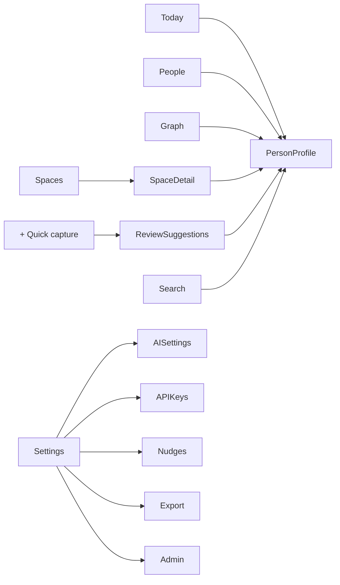

# FolkBook — UI Flows

Screens, flows and interaction ideas to design in Claude Design and then implement.
Status: draft. Update it as decisions change.

---

## 1. Design direction: warm notebook

FolkBook should feel like a **personal address book**, not a corporate CRM.

- **Palette:** warm paper background (cream / off-white), ink-dark text, one accent ink color (e.g. deep blue or burgundy), muted tab colors for spaces
- **Type:** a serif for names and headings (the "handwritten address book" feel), a clean sans for UI and body text
- **Materials:** subtle paper texture, index-card and sticky-note shapes, tabbed dividers, polaroid-style photos
- **Dark mode:** "notebook at night": warm charcoal paper, cream ink. Not pure black
- **Motion:** short, purposeful, physical (paper, ink, tabs). Always respect "reduce motion"
- **Restraint:** the notebook metaphor lives in details, not everywhere. Forms and lists stay fast and plain

---

## 2. Navigation

| | Mobile (bottom tab bar) | Desktop (left sidebar) |
|---|---|---|
| **Today** | ✓ | ✓ |
| **People** | ✓ | ✓ |
| **Graph** | ✓ | ✓ |
| **Spaces** | inside People (filter chips) | ✓ own section |
| **Quick capture** | center "+" button | "Quick capture" button + `Shift+N` |
| **Add person** | from People | `N` shortcut, command palette |
| **Search** | top of People | `Ctrl/Cmd + K` command palette |
| **Settings** | avatar menu | avatar menu |

```mermaid
flowchart LR
  Today --> PersonProfile
  People --> PersonProfile
  Graph --> PersonProfile
  Spaces --> SpaceDetail --> PersonProfile
  QuickCapture["+ Quick capture"] --> ReviewSuggestions --> PersonProfile
  Search --> PersonProfile
  Settings --> AISettings & APIKeys & Nudges & Export & Admin
```

---

## 3. Flows

### 3.1 First run (server admin)
1. Open the fresh instance → "Welcome to your FolkBook" setup page
2. Create the admin account
3. Create your **Me** profile (name, photo, birthday), shown as the first card in your notebook
4. Optional steps (skippable): import contacts (.vcf) · add an AI key · invite others
5. Land on **Today** with a friendly empty state ("Your notebook is empty, add your first person")

### 3.2 Invite & join
1. Admin → Settings → Users → **Create invite link** (optional expiry, optional email note)
2. Invitee opens link → creates account → creates **Me** profile
3. Same optional steps as first run
4. If the invite came with a shared space, show "Defne shared *Hackathon 2026* with you" on Today

### 3.3 Add a person (manual)
1. "+" → **Add person**
2. Minimal form: name (required), photo, pronouns (optional chips: not set · she · he · they), "how we met", spaces (multi-select chips)
3. "More details" expands: work, birthday, contact info, tags
4. Save → lands on the new profile with a hint: "Add something to remember about them"

### 3.4 Person profile (the most important screen)
Top to bottom:
1. **Header:** polaroid photo, name (serif), pronouns if set, "how we met" line, space tabs (shared ones marked with a people icon)
2. **Remember:** memory aids as sticky notes (kids' names, allergies, favorite team…). Add, edit or pin quickly: the pin button on a note (shown on hover or focus, always on touch screens) tacks it to the top, and the first pinned note is the hint on their keep-in-touch nudge on Today. Always private
3. **Notes:** free-form, private
4. **Connections:** relationships list + mini graph; family relations grouped (parents, partner, siblings, derived: cousins, in-laws)
5. **Timeline:** interactions (met, called, coffee…), newest first
6. **Keep in touch:** off / every N weeks / custom (only when nudges are enabled)

Actions: edit · add relationship · log interaction · add to space · open in graph · delete.

For a **shared person you don't own**: basic profile is read-only (or editable with editor role); your notes and memory aids are still yours and private. A small "Shared by Defne · Hackathon 2026" label. **⋯ → Remove from my book…** hides them just for you (Undo for 10 seconds); the space page lists them under "Taken out of your book" with **Add back**.

### 3.5 Quick capture with AI
1. "+" → **Quick capture** → a notebook-page textarea
   *"Met Tom at the hackathon, designer at Spotify, he's Emma's cousin, likes climbing"*
2. Optional: pick a default space for everything captured (e.g. "Hackathon 2026")
3. **Suggest**: AI returns a draft:
   - New people (with fields filled in)
   - Matches to existing people ("Emma → Emma Yılmaz?", pick or create new)
   - Relationships (Tom ↔ Emma: cousin)
   - Memory aids (likes climbing), spaces, tags
4. **Review screen**: every suggestion is an editable card with a checkbox. Edit, uncheck or add
5. **Confirm** → everything saved at once → summary: "Added 1 person, 1 relationship, 1 memory aid"
6. No AI key set → the button explains how to add one; manual form still available

### 3.6 Import contacts (.vcf)
1. Settings → Import (or onboarding) → upload `.vcf`
2. Parsed list with checkboxes, all unchecked by default ("select who you actually know")
3. Duplicate detection: "Looks like Anna K. already exists → merge / skip / import as new"
4. Optional: assign selected people to a space
5. **Enrichment mode** (optional): card-by-card walk through imported people: "How do you know Anna?", add a memory aid, skip. Swipe/next on mobile
6. Summary + "continue enriching later" reminder on Today

### 3.7 Spaces
- **Create:** name, color/tab, optional description. Private by default
- **Add people:** from the space page, from a profile, or by multi-select in People
- **Share:** Space → Share → pick users on the server → role (viewer / editor) → first-time explainer:
  *"Members will see these 12 people's basic profiles and this space's links. Your notes and memory aids stay private."*
  The dialog also has the contact-details toggle (off by default) and lists members with a role picker; the space page shows "Who sees this space". Only accounts on this server
- **Adding someone to a shared space:** first-time confirmation ("Tom will be visible to 4 people", with who they are) and "Don't ask again" for that space, remembered on the device
- **Shared indicator:** people icon on the space tab everywhere it appears
- **Leave / unshare:** a member leaves from the space's ⋯ menu (a dialog lists who they'd keep a copy of); the owner removes a member from the member's ⋯ in "Who sees this space", or picks ⋯ → Stop sharing. People they wrote notes on become their own kept copies (§3.14)

### 3.8 Relationships
1. Profile → Connections **+ Add** → pick person (search, or create someone new by name) → pick type
   - Family: parent of / child of (then biological / adoptive / step), partner. Siblings, cousins, in-laws are derived from these
   - Other family, for when the connecting people are unknown: sibling, cousin, grandparent, grandchild, aunt / uncle, niece / nephew. Stored as a direct link; once the parents are added, the derivation explains it
   - Social: friend, colleague, classmate, met at…, custom
2. Optional: start date, which space the link belongs to (defaults to a space both people share; "No space" keeps it private)
3. The **⋯ menu** on a link you made: Change type (same two people), Open their page, End this relationship…, Reopen (a former link), Remove the link (with Undo)
4. **Ending a relationship** (divorce, left a job): end date or "Don't know" → status becomes *former*. The dialog lists who moves to "Former" with it (e.g. in-laws); derived in-laws update automatically. Parent links never end. Undo reopens it

### 3.9 Graph view
- **Default:** you ("Me") pinned in the center, people around, clustered and colored by their first space (each space's ring and name in its own color); former links dashed. Being in a space draws no line (the ring shows it; a line from you to everyone in your spaces read as a relationship you don't have); between users who share a space a faint dotted line. A line's words (the relationship, or "shares Hackathon") show only on the lines of the person you point at or select, or on the one line you point at or tap (anywhere within a few pixels of it: the lines are too thin to hit exactly) (their lines and people light up); on every line at once they piled up on the names. The graph fills the screen under the header and filters; what the colors and clicks mean is behind an ⓘ button by the zoom buttons, hidden until asked for
- **Filter bar:** space chips (any number), "Family only" (family links and the people on them), "Hide former"
- **Click a node:** desktop opens the same peek panel as People; phones get a bottom sheet (name, how you met, a memory aid → Open profile · Focus · Log). Click the canvas to close
- **Focus mode:** *Focus* on the phone sheet shows only that person and the people one step away; "Show everyone" goes back. No double-click (removed: easy to trigger by accident)
- The graph appears where its layout ends up, with no animation: animated, the lines swung round as people flew out from the middle
- Zoom in / out / Fit buttons; empty graph: "Your graph starts with you"
- Later: **"How do I know…?"** (the path from Me drawn as an ink line, #34), family tree (#36), folded space bubbles for big notebooks (#35)

### 3.10 Family tree mode
- Toggle in Graph ("Network / Family tree") or from a profile ("View family tree")
- Generational layout (grandparents above, children below), partners side by side
- Former partners shown with a dashed line; step/adoptive parents with a label
- Tap an empty slot ("Add mother") to fill in missing family

### 3.11 Log an interaction
- From profile: **Log** (or `L`) → type (met, call, message, event, other) → date (today, yesterday or any earlier day) → time (optional) → note
- **Turn selection into a memory aid:** puts the words selected in the note on a sticky note, added when the entry is saved; with nothing selected it says to select some first
- When changing an entry, **Delete** sits at the bottom left
- One-tap logs from Today (*Wish*, *We talked*) record the time too
- Saving shows an Undo toast (undo also removes sticky notes made from the note)
- Tap an entry on the timeline to change or delete it; deleting also has Undo
- From Today's nudge card: one-tap "We talked" → optional note
- Logging an interaction resets that person's keep-in-touch timer

### 3.12 Today (home screen)
Sections, each hidden when empty; with nothing at all, an empty state (Add someone · Quick capture). Dates come from the device, so "today" follows the user's time zone.
1. **Birthdays** (today and the next 7 days): "Turns 34 today" → *Wish* logs "Birthday wishes" in one tap (Undo)
2. **Keep in touch:** nudge cards (see DECISIONS for when someone is due), with a pinned memory aid as a hint → *We talked* (logs "Talked" today) · *Snooze* (a week) · *Stop*; each with Undo
3. **Remember?** a random memory aid on a sticky note → *Show another*
4. **Sharing ended:** people who left your book because of someone else, and who you kept (§3.14)
5. **Shared with you:** spaces others shared with you → *Open space* · *Dismiss* (remembered on this device)
6. **Fill in the blanks:** people without "how you know them" → *Start with Anna →* · *See all*
7. **Recently added:** people added to your book in the last 30 days

### 3.13 Search
- One search over names, how you met, work, tags, spaces, and your own notes and memory aids (only what you can see; accents and case don't matter)
- Results grouped: People, Spaces, Memory aids, Notes (with the words around the match), then pages and actions
- Nothing found: "Nothing matches …", a "Did you mean" for a close name, and "Add “Tahir” as a new person" (opens the form with the name filled in)
- Desktop: `Ctrl/Cmd + K` palette; phones: the same as a Search page (button on Today)

### 3.14 Access revoked
- When someone else ends your access (stops sharing, removes you, deletes the space, or takes out or deletes someone you wrote about): a toast once per account (not again on your other devices) + a Today card until dismissed:
  *"Defne stopped sharing Hackathon 2026. You kept 3 people you had notes on."* with the kept people, *Review kept people* · *Dismiss*
- When you leave yourself, the toast says who you kept
- Kept people become your own copies: marked **Kept** on their profile with *"Kept copy · was shared by Defne in Hackathon 2026 until 22 Sep 2026"* and *Add to a space*; People has a **Kept** filter while you have any

### 3.15 Settings
- **Profile & account:** Me profile, password, sessions
- **AI:** provider (Gemini / OpenAI-compatible base URL), API key, model, "Test connection"
- **API keys:** list (name, scopes, last used, expiry) → create (shown once, copy button) → revoke
- **Nudges:** global on/off, default interval, email frequency (daily / weekly digest), "Send test email"
- **Admin only: email (SMTP):** host, port, user, password, from address, TLS, "Send test email". Can also be set via env vars. Not configured → banner: "Email isn't set up; reminders only show on Today"
- **Import / Export:** .vcf import, full export (JSON + photos: "Everything", with how many people and photos and the rough size, and a reminder that it holds private notes), .vcf export, restore
- **Appearance:** light / dark / system, reduce motion
- **Admin only:** users, invite links, server info

---

## 4. Screen inventory

| # | Screen | Mobile | Desktop |
|---|---|---|---|
| 1 | Setup / first run | full screen | centered card |
| 2 | Invite accept + sign up | full screen | centered card |
| 3 | Log in | full screen | centered card |
| 4 | Today | tab | main view |
| 5 | People list (filters, search) | tab | main view + list/grid toggle |
| 6 | Person profile | full page | page or side panel |
| 7 | Add / edit person | full page sheet | modal |
| 8 | Quick capture + review | full page | modal / wide panel |
| 9 | Import (.vcf) + enrichment | multi-step | multi-step |
| 10 | Spaces list + space detail | inside People | sidebar section |
| 11 | Share space dialog | bottom sheet | modal |
| 12 | Add relationship | bottom sheet | popover / modal |
| 13 | Graph (network / family tree) | tab | main view + side panel |
| 14 | Command palette | — | overlay |
| 15 | Settings (all sections) | stacked pages | tabs |

---

## 5. Interaction ideas ("spells")

Inspired by the kind of details collected on [Design Spells](https://designspells.com/), adapted to the notebook theme. Nice-to-haves: the core flows come first.

- **Page turn:** opening a profile from a list feels like flipping to that page (shared-element transition: the card grows into the profile)
- **Ink underline:** saving draws a quick ink stroke under the name / field
- **Sticky notes:** memory aids tilt slightly and "stick" when added; peel animation on delete
- **Polaroid photo:** photo drops in with a slight rotation on upload
- **Long-press person card (mobile):** radial or popup quick menu: log interaction, add memory aid, open in graph
- **Ink path in graph:** "How do I know…?" draws the path hop by hop like a pen stroke
- **Tabbed dividers:** switching spaces slides the colored tab like a notebook divider
- **Delete = tear out:** profile **⋯ → Tear out of the book…** → a confirm dialog lists what goes with them (connections, your memory aids, timeline and note, the spaces they leave) and warns who in a shared space will stop seeing them, by name ("Bora Kaya will no longer see Deniz there"; past four names, "and N others") → the page tears away and a 10-second Undo toast appears
- **Birthday occasion:** subtle confetti / doodle on a person's profile on their birthday
- **Doodle empty states:** hand-drawn illustrations for empty Today, empty graph, no results
- **Easter egg:** tapping your own "Me" polaroid a few times flips it to a hidden back side
- **Reduce motion:** every effect has a simple fade fallback

---

## 6. Decisions & open questions
- [x] No voice input for quick capture (text only)
- [x] Reminders go out by email only (plus the in-app Today cards). Self-hosters configure their own SMTP; the paid hosted version sends through our server
- [x] Profile on desktop: peek side panel from lists/graph + "expand" to full page (full page has its own URL). Mobile is always full page
- [x] Graph default: show everyone when the visible notebook is small (~300 people or fewer); otherwise start with Me + 2 hops, and show other spaces as collapsed bubbles you can expand. "Show all" toggle always available. Tune the ~300 limit after performance tests
